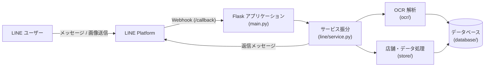

# line-bot-features

LINE Messaging API を利用した、各種便利機能を提供する Python / Flask 製のチャットボットアプリケーションです。  
ユーザーからのテキストや画像メッセージを受信し、店舗情報の管理やOCRによる文字読み取りなどの処理を行います。

---

## 主な機能

- **メッセージ応答 / ルーティング**: LINE Messaging API の Webhook イベントを受信し、メッセージ内容に応じて適切な処理へディスパッチ。
- **画像 OCR 処理**: 受信したレシートや画像からテキストを抽出し、データ化。
- **店舗・支出データ管理**: 読み取ったデータやユーザー入力をデータベースへ保存・集計。

---

## システムフロー



---

## 技術スタック

- **言語 / フレームワーク**: Python 3, Flask, Gunicorn
- **SDK / 外部API**: line-bot-sdk, Cloud Vision API / Tesseract (OCR)
- **設定・実行環境**: Procfile (Heroku / 各種PaaS対応), Python venv

---

## セットアップと実行

### 1. 仮想環境の作成と依存関係のインストール

```bash
python -m venv .venv
source .venv/bin/activate
pip install -r requirements.txt
```

### 2. 環境変数の設定

`.env.example` を参考に `.env` ファイルを作成し、必要なトークンを設定します。

```bash
cp .env.example .env
```

主な設定項目:
- `LINE_CHANNEL_SECRET`: LINE Messaging API のチャネルシークレット
- `LINE_CHANNEL_ACCESS_TOKEN`: LINE Messaging API のチャネルアクセストークン
- データベース接続URLなど

### 3. ローカル起動

```bash
python main.py
```

デフォルトでローカルサーバが起動し、`/callback` エンドポイントで Webhook を待ち受けます。

---

## ディレクトリ構成

```text
line-bot-features/
├── main.py                  # アプリケーションエントリポイント（Webhook 受信）
├── line/                    # LINE メッセージイベントのハンドリングとサービス振り分け
├── ocr/                     # 画像解析・文字認識モジュール
├── store/                   # 店舗・支出情報のビジネスロジック
├── database/                # データアクセス・永続化層
├── const/                   # 定数および環境変数定義
└── tests/                   # テストコード
```
